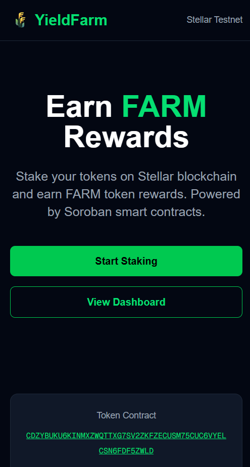
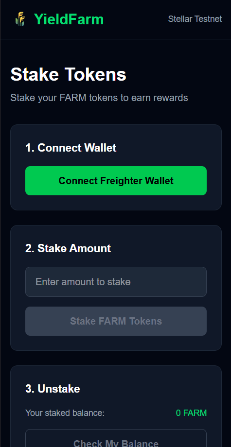

#  Yield Farm on Stellar

A production-ready yield farming dApp built on Stellar Soroban smart contracts with inter-contract calls, custom token, real-time event streaming, and CI/CD pipeline.

##  Live Demo
[https://yield-farm-stellar-8uv3.vercel.app](https://yield-farm-stellar-8uv3.vercel.app)

##  Demo Video
[ Watch Demo](https://drive.google.com/file/d/1uMCn6_QsydUx1BosAz7PqVvBeeCOypV7/view?usp=drive_link)

##  Screenshots

### Mobile Responsive View


### Staking Page


### CI/CD Pipeline


##  Contract Addresses & Transaction Hashes

### Token Contract (FARM Token)
- **Address:** `CDZYBUKU6KINMXZWQTTXG7SV2ZKFZECUSM75CUC6VYELCSN6FDF5ZWLD`
- **Deploy TX:** `d96798b1f6dd3f9aeb914808a3f18d6bc16aa002ee88c787e3377e6c49f37a536`
- **Explorer:** [View on Stellar Expert](https://stellar.expert/explorer/testnet/contract/CDZYBUKU6KINMXZWQTTXG7SV2ZKFZECUSM75CUC6VYELCSN6FDF5ZWLD)

### Staking Contract
- **Address:** `CBCUSXYHAFKET2P6RB7RWDEERDMYY5RAQGNPML2FKN3H7WN2J3C6EQYI`
- **Deploy TX:** `819763d3c73ba7a1f5fae2d8104f57ed2b7d56b62a331138cce94436afbc7895e`
- **Explorer:** [View on Stellar Expert](https://stellar.expert/explorer/testnet/contract/CBCUSXYHAFKET2P6RB7RWDEERDMYY5RAQGNPML2FKN3H7WN2J3C6EQYI)

### Inter-Contract Call
The staking contract calls the token contract's `transfer()` function when:
- User stakes tokens → `token.transfer(user → staking_contract)`
- User unstakes → `token.transfer(staking_contract → user)`
- User claims rewards → `token.transfer(staking_contract → user)`

##  Custom Token
- **Token Name:** Farm Token
- **Symbol:** FARM
- **Decimals:** 7
- **Contract:** `CDZYBUKU6KINMXZWQTTXG7SV2ZKFZECUSM75CUC6VYELCSN6FDF5ZWLD`
- **Network:** Stellar Testnet

##  Tech Stack
- **Smart Contracts:** Rust + Soroban SDK v22
- **Frontend:** Next.js 16 + Tailwind CSS
- **Wallet:** Freighter
- **Network:** Stellar Testnet
- **CI/CD:** GitHub Actions → Vercel

##  Features
-  Custom FARM token (SEP-41 compatible)
-  Faucet — get free test tokens instantly
-  Staking contract with inter-contract calls to token contract
-  Real-time event streaming from Soroban contracts
-  Stake, Unstake, Claim Rewards functionality
-  Real token balance & pending rewards display
-  Dynamic reward rate fetched from contract
-  Freighter wallet integration
-  Mobile responsive UI
-  CI/CD pipeline (GitHub Actions)
-  Deployed on Vercel

##  Project Structure
```
yield-farm-stellar/
├── contracts/
│   ├── token/          ← FARM token contract (Rust)
│   └── staking/        ← Staking + rewards contract (Rust)
├── frontend/           ← Next.js + Tailwind CSS
│   ├── app/
│   │   ├── page.tsx        ← Landing page
│   │   ├── stake/          ← Stake/Unstake/Claim UI
│   │   └── dashboard/      ← Live event streaming
│   └── lib/
│       └── contracts.ts    ← Contract addresses config
└── .github/
    └── workflows/
        └── ci.yml      ← CI/CD pipeline
```

##  Run Locally
```bash
# Clone the repo
git clone https://github.com/janhavilipare17/yield-farm-stellar.git
cd yield-farm-stellar

# Install frontend dependencies
cd frontend
npm install
npm run dev

# Open http://localhost:3000
```

##  Build Contracts
```bash
# Token contract
cd contracts/token
stellar contract build

# Staking contract
cd contracts/staking
stellar contract build
```

##  Network
- **Network:** Stellar Testnet
- **RPC URL:** https://soroban-testnet.stellar.org
- **Passphrase:** Test SDF Network ; September 2015
